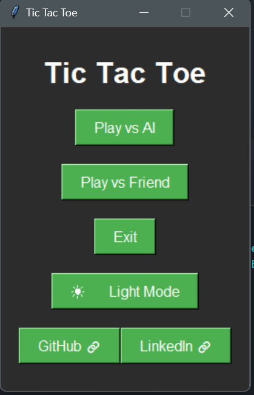

# Tic Tac Toe Game

A Python implementation of Tic Tac Toe with both AI and two-player modes, featuring a modern GUI and theme switching.

---

## Features

- **Game Modes**:
  - Player vs AI (using A* algorithm)
  - Player vs Player
- **Theme Switching**: Dark and Light modes
- **Score Tracking**: Persistent for the current session
- **Responsive GUI**
- **Social Media Links**: Directly accessible within the game

---

## Built-In Libraries and Their Uses

1. **`tkinter`**:
   - **Purpose**: Builds the game's GUI components like windows, buttons, labels, etc.

2. **`dataclasses`**:
   - **Purpose**: Defines the `Move` class, representing a move on the game board.

3. **`enum`**:
   - **Purpose**: Represents players (`X`, `O`, `EMPTY`) and themes (`LIGHT`, `DARK`) using enumerations.

4. **`heapq`**:
   - **Purpose**: Efficiently manages open sets of nodes in the A* algorithm.

5. **`typing`**:
   - **Purpose**: Adds type annotations for better code readability and maintainability.

---

## File Structure

- **`main.py`**: Entry point of the application.
- **`game_menu.py`**: Main menu interface.
- **`ai_game.py`**: AI game mode implementation using A* algorithm.
- **`two_player_game.py`**: Two-player game mode.
- **`base_game_gui.py`**: Base GUI components and shared functionality.
- **`game_state.py`**: Manages game state for the AI.
- **`board.py`**: Implements game board logic.
- **`move.py`**: Defines the Move data structure.
- **`player.py`**: Contains Player enumeration.
- **`theme.py`**: Handles theme configurations.

---

## Game Modes

### **Player vs AI**
- The AI uses the A* algorithm for strategic gameplay.
- Moves are selected based on heuristic evaluation of board states.

### **Player vs Player**
- Local multiplayer mode with turn-based gameplay.
- Keeps track of scores for both players.

---

## Theme System

Switch between Light and Dark themes:
- **Light Theme**: Bright and clean interface.
- **Dark Theme**: Ideal for low-light environments.

---

## Controls

- Click on an empty cell to make a move.
- Use the **Theme Toggle** button to switch themes.
- Use the **Reset** button to start a new game.
- Use the **Back** button to return to the main menu.

---

## AI Implementation

The AI uses the A* algorithm with the following features:
- **Path Cost Calculation**: Evaluates moves based on their strategic value.
- **Heuristic Evaluation**: Determines optimal board states.
- **State Space Search**: Explores possible game outcomes efficiently.
- **Move Prioritization**: Selects the most promising moves.

---
## Screenshots

### Menu - Start Game (Dark Theme)

### Menu - Start Game (Light Theme)

### Game Board (Light Theme)

### Game Board (Dark Theme)

